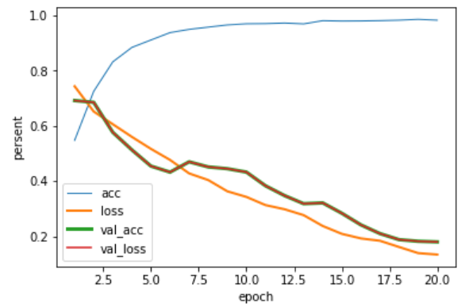
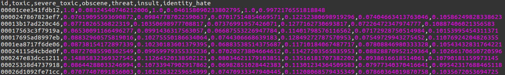

# textAnalysisLSTM

1. what you need 
- Download the pre-trained word vectors [GloVe](https://nlp.stanford.edu/projects/glove/)
- Get raw [dataset](https://www.kaggle.com/c/jigsaw-toxic-comment-classification-challenge/data) from kaggel 

2. Results
- The training and testing process:

- Classification result:

